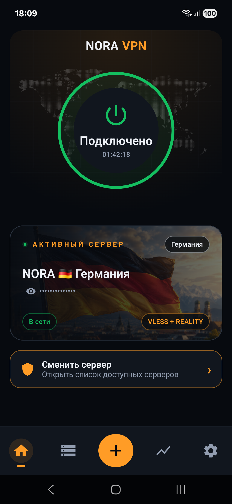
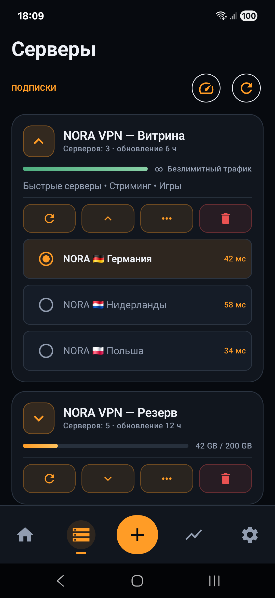
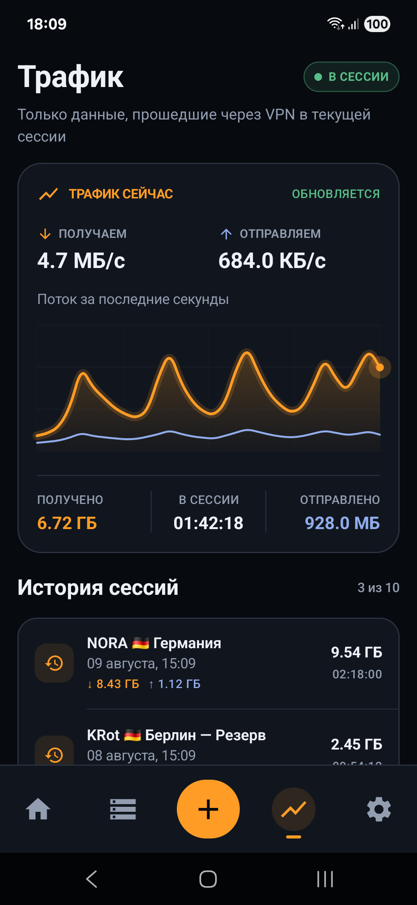

  
  <h1>NORA VPN</h1>
  
A visual-first Android VPN client with KRot, VLESS/REALITY and AmneziaWG 2.0.

  

    
    
    
    
    
  

  

    
    
    
  

  

    <a href="#русская-версия">Русский</a> ·
    <a href="https://github.com/kevin-popins/NORA-VPN-DESKTOP">Версия для Windows</a> ·
    <a href="docs/krot-android.md">KRot</a>
  

<table>
  <tr>
    <td width="33.33%"></td>
    <td width="33.33%"></td>
    <td width="33.33%"></td>
  </tr>
</table>

## Русская версия

### Что это за проект

**NORA VPN** — мобильное приложение для подключения к VPN на Android. Оно объединяет прямые профили и подписки, выбор серверов, раздельное туннелирование, статистику трафика и системное управление подключением в одном понятном интерфейсе.

Одно из ключевых направлений проекта — безопасная работа per-app VPN. В некоторых VPN-клиентах локальный SOCKS5 может стать обходным каналом, через который приложение вне VPN попытается определить внешний IP VPN-сервера. NORA VPN автоматически создает защищенные данные localhost SOCKS и не оставляет этот канал доступным приложениям вне раздельного туннеля. Ручная первоначальная настройка SOCKS не требуется.

Защита проверялась открытыми инструментами:

- [YourVPNDead](https://github.com/loop-uh/yourvpndead).
- [ProxyBypass (per-app-split-bypass-poc)](https://github.com/runetfreedom/per-app-split-bypass-poc).

Описание класса проблемы: [статья на Хабре](https://habr.com/ru/articles/1020080/). Стороннее приложение все еще может определить сам факт работы VPN по косвенным признакам; задача NORA VPN — не раскрывать через локальный обходной канал выходной IP VPN-сервера.

Android-версия продолжает визуальный стиль NORA VPN для Windows. Версия для компьютера находится в репозитории [NORA-VPN-DESKTOP](https://github.com/kevin-popins/NORA-VPN-DESKTOP).

### Возможности

- Подключение по **KRot**.
- Подключение по **Xray / VLESS / REALITY**.
- Подключение по **AmneziaWG 2.0**.
- Импорт прямых профилей, конфигурационных файлов и подписок.
- Открытие профилей через Android **Открыть в...** и **Поделиться**.
- Ручное и автоматическое обновление подписок.
- Выбор сервера и замер задержки.
- Раздельное туннелирование для выбранных приложений.
- Статистика текущего VPN-трафика и история сессий.
- DNS из профиля и пользовательские DNS-серверы.
- Автоматически настроенный localhost SOCKS с авторизацией.
- Быстрое управление через плитку Android и системное уведомление.
- Поддержка HAPP/Marzban подписок и HAPP `crypt5`.

### Поддерживаемые форматы импорта

- `nora1.` — ключ подключения KRot.
- `vless://`.
- `vmess://`.
- `trojan://`.
- `happ://crypt5/...`.
- `happ://routing/add/...` и `happ://routing/onadd/...`.
- Xray JSON.
- AmneziaWG 2.0 (`.conf`).
- HTTP(S)-подписки.

### Как начать

1. Установите и откройте NORA VPN.
2. Нажмите `+` и добавьте ключ, профиль, файл конфигурации или подписку.
3. Выберите сервер.
4. Нажмите кнопку подключения и подтвердите системный запрос Android.

### Документация

- [Установка](README_INSTALL_RU.md).
- [Обзор приложения](docs/architecture.md).
- [KRot на Android](docs/krot-android.md).
- [Подписки и совместимость](docs/subscriptions.md).
- [Коды ошибок](docs/error-codes.md).
- [Безопасность](docs/security.md).

### Статус проекта

Рабочая pre-release версия. Проект развивается, а совместимость с новыми форматами и провайдерами постепенно расширяется.

### Лицензия

Проект распространяется по лицензии **Apache License 2.0**. Полный текст: [LICENSE](LICENSE).
